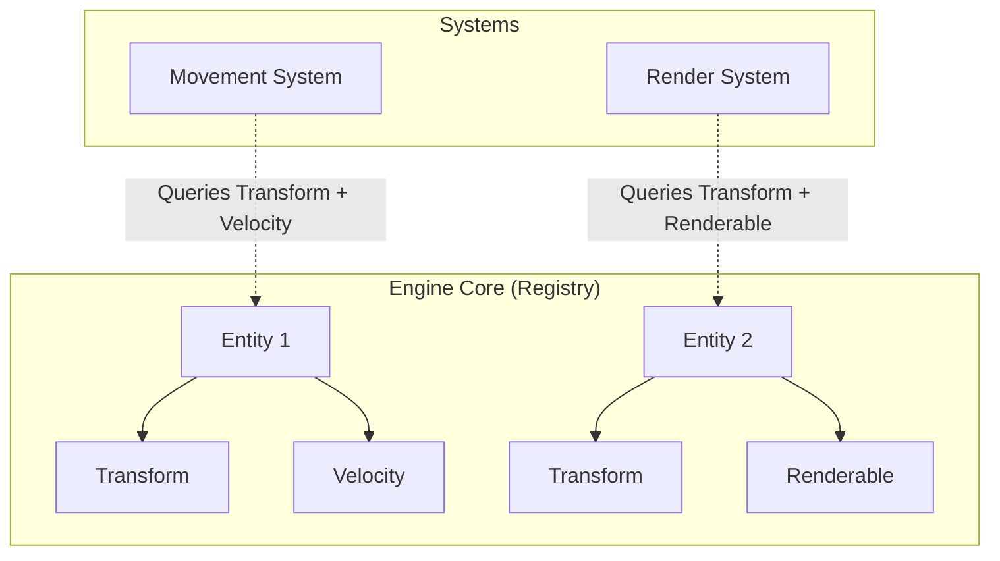

# Game Engine (ECS)

## 1. Introduction

The R-Type Game Engine is built as a generic, reusable, and modular standalone library. It is strictly decoupled from the specific gameplay rules and assets of R-Type. This modularity ensures that the engine can power different types of games (such as Pong or other custom titles) to demonstrate true reusability as required by Track #1.

## 2. Core Paradigm: Entity-Component-System (ECS)

To maximize performance, flexibility, and architectural decoupling, the engine is designed around a custom **Entity-Component-System (ECS)** architecture (Data-Oriented Design).

### 2.1 Entities

An **Entity** is not an object containing behaviors. It is simply a lightweight, unique identifier (e.g., `uint32_t` or `size_t`). Entities serve as logical handles to associate components together.

### 2.2 Components

**Components** are Plain Old Data (POD) structures containing state only and no business logic or methods.

- `Transform`: Position (`x`, `y`), rotation, and scale.
- `Velocity`: Directional speed (`dx`, `dy`).
- `Renderable`: Sprite ID, color tint, animation frame.
- `Collider`: Bounding box or radius for hit testing.
- `Health`: Current and maximum hit points.

### 2.3 Systems

**Systems** hold all game logic and behavior. Systems do not target concrete game concepts (e.g. "Spaceship" or "Monster"), but rather process entities matching a specific set of components:

- **MovementSystem:** Updates `Transform` positions based on `Velocity` and delta time.
- **RenderSystem:** Queries entities having `Transform` and `Renderable` components to draw them via the graphics backend.
- **CollisionSystem:** Evaluates overlap between entities with `Transform` and `Collider`.

### 2.4 The Registry & Sparse Sets

The **Registry** coordinates the entire ECS lifecycle:

- Entity allocation, recycling, and destruction.
- Component storage organized using **Sparse Sets** for each component type, ensuring contiguous memory layout in cache and $O(1)$ lookups/insertions/removals.
- Filtering and view iteration for systems.



## 3. Engine Subsystems

The engine is partitioned into decoupled subsystems:

- **ECS Core:** Manages entity lifecycles, component pools, and system execution order.
- **Rendering & Audio (Raylib):** Abstracts 2D drawing, textures, sprite batching, font rendering, and sound effects.
- **Physics & Collisions:** Manages spatial partitioning (e.g., Quadtree or Grid) and AABB collision queries.
- **Event Bus:** Decoupled publisher/subscriber messaging mechanism enabling asynchronous events (e.g., audio triggers on collision without direct coupling).
- **Network Abstraction (Asio):** Transport layer supporting both TCP (lobby, auth) and UDP (real-time gameplay state synchronization).

## 4. Decoupling & Modularity

1. **Standalone Library:** Built independently as a static or dynamic library with its own build targets.
2. **Game Agnostic:** Does not contain any R-Type specific references (no hardcoded player, enemy, or bullet logic).
3. **Pluggable Systems:** Games register their own domain-specific components and systems into the engine's `Registry`.

## 5. Developer Tutorial: How to use the ECS

This section provides a quick how-to for new developers joining the project.

### 5.1 Defining a Component

Components are purely Data (POD). No methods, no inheritance.

```cpp
struct Transform {
    float x;
    float y;
};

struct Velocity {
    float dx;
    float dy;
};
```

### 5.2 Spawning an Entity & Adding Components

Use the `Registry` to spawn entities and attach your components using designated initializers.

```cpp
ecs::Registry registry;
registry.register_component<Transform>();
registry.register_component<Velocity>();

ecs::Entity player = registry.spawn_entity();
registry.add_component<Transform>(player, {.x = 100.0F, .y = 100.0F});
registry.add_component<Velocity>(player, {.dx = 5.0F, .dy = 0.0F});
```

### 5.3 Writing a System

Systems are just logic blocks (often lambda functions) passed to `run_system`. The registry automatically fetches the entities that possess *all* the requested components.

```cpp
// MovementSystem: Applies velocity to transform
void update_movement(ecs::Registry& registry, float dt) {
    registry.run_system<Transform, Velocity>([dt]([[maybe_unused]] ecs::Entity e, Transform& pos, Velocity& vel) {
        pos.x += vel.dx * dt;
        pos.y += vel.dy * dt;
    });
}
```

### 5.4 Using the Event Bus

To decouple systems, use the `EventBus`. Define an event struct, subscribe to it, and publish it anywhere.

```cpp
struct PlayerDamagedEvent {
    ecs::Entity player_id;
    int damage;
};

ecs::EventBus bus;

// Subscribing (e.g., in an AudioSystem)
auto token = bus.subscribe<PlayerDamagedEvent>([](const PlayerDamagedEvent& event) {
    // Play "Oof" sound
});

// Publishing (e.g., in a CollisionSystem)
bus.publish(PlayerDamagedEvent{.player_id = player, .damage = 10});
```
