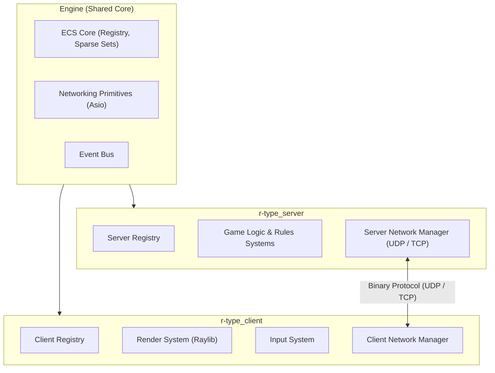
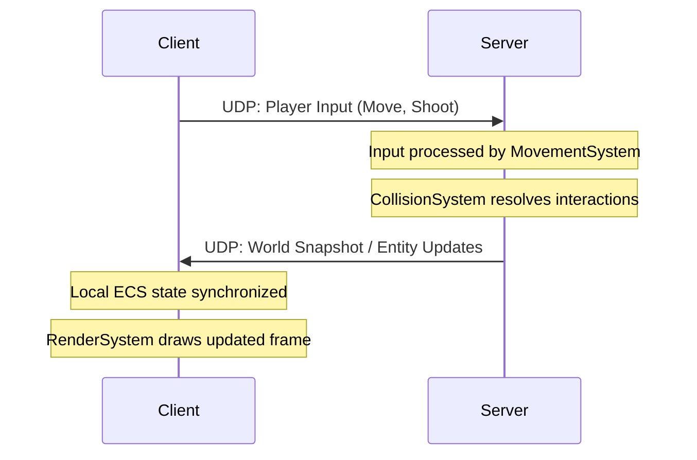

# Architecture Overview

## 1. High-Level Architecture

The project is structured into three primary tiers:

1. **Engine Core:** An agnostic standalone library providing ECS, event dispatching, rendering wrappers (Raylib), and networking primitives (Asio).
2. **Authoritative Server:** Hosts game simulation sessions, runs logical systems, enforces validation, and synchronizes states.
3. **Graphical Client:** Renders the world, handles local inputs, performs interpolation and client-side prediction, and queries user devices.

## 2. Client-Server Synchronization Model

The game follows an **Authoritative Server** architecture:

- **Client:** Captures player input and sends it across UDP datagrams. It renders local feedback and reconciles discrepancies when server updates arrive.
- **Server:** Runs at a fixed simulation tick rate, advances the game state, handles collision and damage calculations, and broadcasts compressed world updates.

