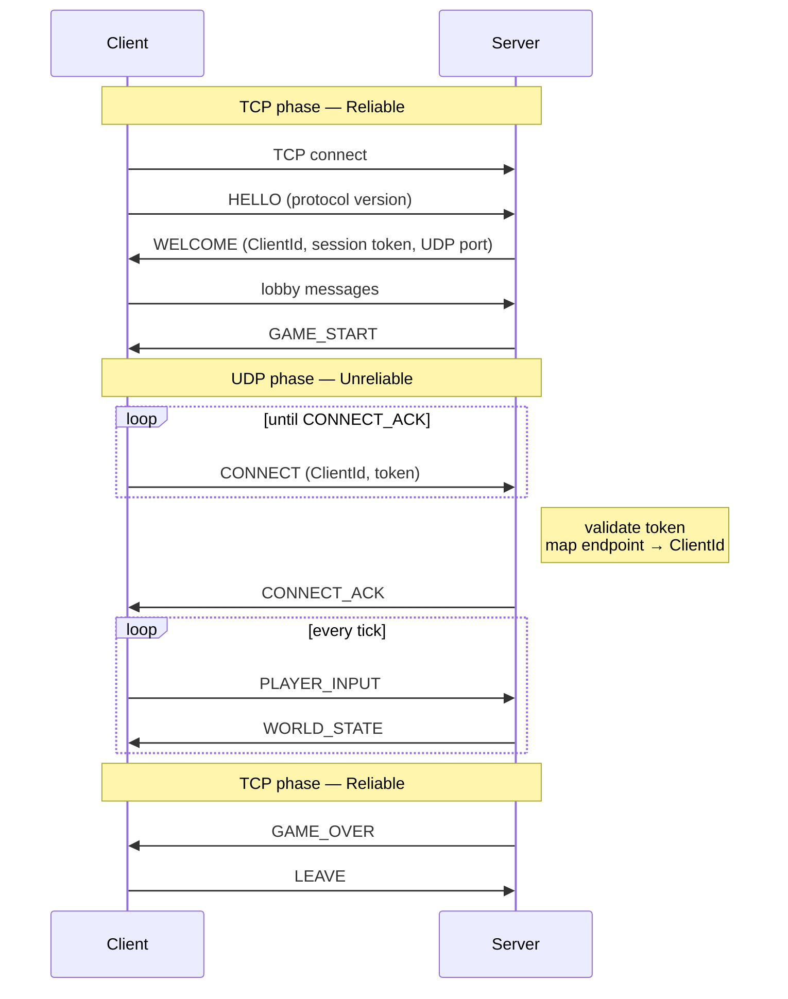

# Network Transport & Connection

This document specifies how messages are mapped to TCP and UDP, how a client connects and disconnects, and how messages
are framed and validated on the wire.

The design of the library implementing it is described in [Network Architecture](../architecture/network.md). The byte
layout of each packet is specified in the [Protocol RFC](rfc.md) and [Packets](packets.md).

---

## Table of contents

1. [Transport: TCP or UDP](#1-transport-tcp-or-udp)
2. [Connection lifecycle](#2-connection-lifecycle)
3. [Framing and validation](#3-framing-and-validation)

---

## 1. Transport: TCP or UDP

### Rule

- Latency matters and old data is useless → **`Unreliable` (UDP)**
- The message must arrive and latency does not matter → **`Reliable` (TCP)**

### Message classification

| Message                    | Phase       | Channel             | Transport | Reason                                            |
|----------------------------|-------------|---------------------|-----------|---------------------------------------------------|
| Handshake, version check   | Before game | Reliable            | TCP       | Must arrive                                       |
| Session token, `ClientId`  | Before game | Reliable            | TCP       | Required to bind the UDP address                  |
| Lobby (rooms, ready state) | Before game | Reliable            | TCP       | Must arrive in order                              |
| Game start                 | Before game | Reliable            | TCP       | Must arrive                                       |
| UDP `CONNECT`              | Game start  | Unreliable, retried | UDP       | Registers the client's UDP address                |
| Player inputs              | In game     | Unreliable          | UDP       | Sent every tick; the next one replaces a lost one |
| World state                | In game     | Unreliable          | UDP       | Sent every tick; stale states are dropped         |
| Critical in-game events    | In game     | Unreliable + ack    | UDP       | Must stay ordered with the world state            |
| Chat                       | Any         | Reliable            | TCP       | Must arrive in order, low volume                  |
| Game over, scores          | After game  | Reliable            | TCP       | Must arrive                                       |
| Leave                      | Any         | Reliable            | TCP       | Clean disconnection                               |

### Constraints on mixing both

- **No ordering between TCP and UDP.** Anything that must stay consistent with the world state goes over UDP.
- **No bulk TCP transfer during a game.** Large TCP transfers fill network queues and increase UDP loss and latency.
  Small TCP messages (chat) have no measurable impact.

---

## 2. Connection lifecycle

### Binding TCP and UDP to one player

1. A TCP connection is accepted. The server assigns a `ClientId` and generates a random session token
   (`std::random_device`, at least 32 bits).
2. The server sends `ClientId + token` over TCP.
3. The client sends UDP `CONNECT (ClientId, token)` every 200 ms until it receives `CONNECT_ACK`.
4. The server validates the token and records `endpoint → ClientId`.

Afterwards:

- every UDP packet from a client carries its `ClientId` and token; invalid tokens are dropped;
- a valid packet from a new endpoint updates the mapping (NAT rebinding, network change);
- TCP and UDP events for the same player carry the **same `ClientId`**.

### Disconnection

| Situation                   | Detection                                            | Result                                    |
|-----------------------------|------------------------------------------------------|-------------------------------------------|
| Player leaves               | `LEAVE`, TCP closed                                  | `Disconnected` event                      |
| Client crash / network loss | TCP closed, or no valid UDP packet for 5 s           | `Disconnected` event                      |
| Server shutdown             | `asio::signal_set` (SIGINT / SIGTERM)                | Clients notified over TCP, sockets closed |
| Server unreachable          | No UDP packet from the server for 5 s, or TCP closed | Client-side `Disconnected` event          |

The client sends an input **every tick, even with no key pressed**. Silence on UDP therefore always means a connection
problem, never an idle player.

---

## 3. Framing and validation

| Transport | Message boundaries                     | Framing                                                  |
|-----------|----------------------------------------|----------------------------------------------------------|
| UDP       | Preserved (one datagram = one message) | None. Each datagram starts with the protocol header      |
| TCP       | Not preserved (byte stream)            | `uint32` length prefix (little-endian), then the payload |

Rules:

- A UDP datagram **must not** exceed **1200 bytes** of payload, to avoid IP fragmentation.
- Any datagram that is too short, too long, or has a wrong magic or version is dropped **before** its payload is read.
- A TCP message whose announced length exceeds the maximum allowed size closes the session.
- Only **valid** packets update a client's `lastSeen`.
